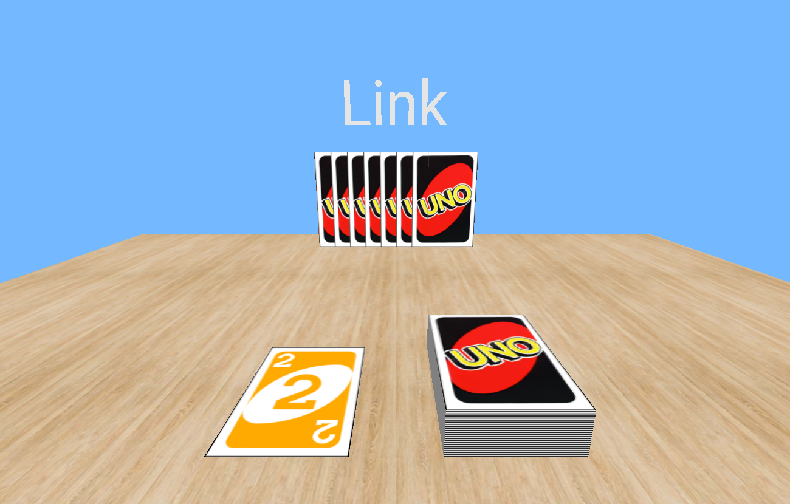
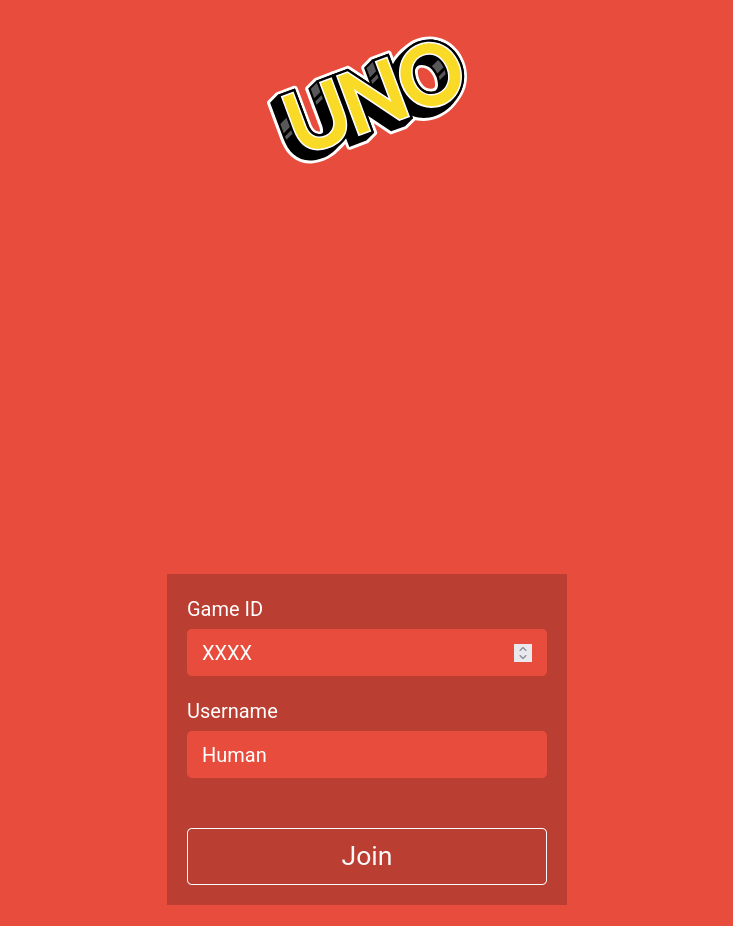
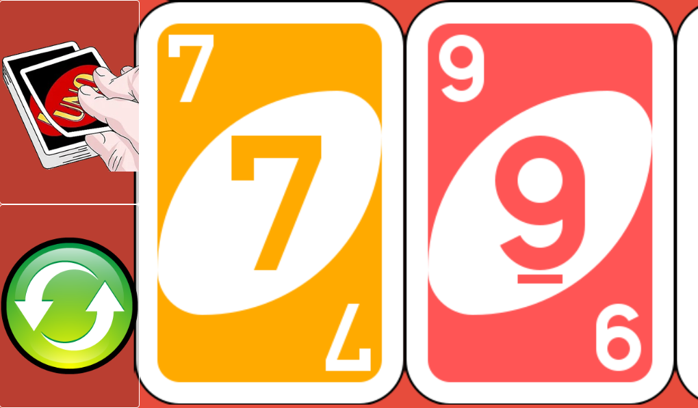

# 🎮 UNO Online
> Un jeu de UNO multijoueur en temps réel avec interface mobile

[](https://opensource.org/licenses/MIT)
[](https://socket.io/)
[](https://nodejs.org/)

[🎮 Jouer maintenant](http://localhost:50000) | [📱 Version mobile](http://localhost:50000/remote) | [📖 Documentation](docs/README.md)

## 🎯 Overview

Ce projet a été développé pendant que j'étais en terminale au lycée donc il se peut qu'il y est quelques erreurs dans la programmation ou dans la méthodologie.
Découvrez UNO Online, une adaptation fidèle du célèbre jeu de cartes en version numérique ! Jouez avec vos amis en utilisant votre téléphone comme manette de jeu, tandis que l'écran principal affiche le plateau sur un PC ou une TV.

### 🖥️ Interface Hôte (PC)

*Vue principale du jeu sur PC avec le plateau et les cartes des joueurs*

### 📱 Interface Mobile
<p align="center">
  
  
</p>
*À gauche : Menu de connexion (portrait) - À droite : Interface de jeu (paysage)*

## 🚀 Caractéristiques

- 🎮 Interface intuitive inspirée du vrai jeu UNO
- 📱 Mode mobile pour utiliser son téléphone comme manette
- 👥 Multijoueur en temps réel
- 🎨 Graphismes fidèles aux cartes originales
- 🔄 Animations fluides
- 🌐 Compatible tous navigateurs modernes

## 🛠️ Technologies

- **Frontend**: HTML5, CSS3, JavaScript vanilla
- **Backend**: Node.js, Express
- **Communication**: Socket.IO 2.3.0
- **Assets**: SVG, PNG optimisés

## 📦 Installation

```bash
# Cloner le repo
git clone https://github.com/Akralan/Game_UNO_3D.git

# Installer les dépendances
cd uno/uno_server
npm install

# Lancer le serveur
node index.js
```

## 🎮 Comment jouer

1. **Hôte (PC)**
   - Ouvrez `http://localhost:50000`
   - Créez une nouvelle partie
   - Partagez le code de partie avec les joueurs

2. **Joueurs (Mobile)**
   - Ouvrez `http://localhost:50000/remote`
   - Entrez le code de partie
   - Orientez votre téléphone en mode paysage

3. **Règles du jeu**
   - [Lien vers les règles détaillées](docs/RULES.md)

## 🏗️ Architecture

```
uno/
├── assets/           # Assets principaux (CSS, JS, images)
│   ├── css/         # Styles
│   ├── js/          # Logique côté hôte
│   ├── svg/         # Logos et icônes
│   └── texture/     # Textures des cartes
├── remote/          # Interface mobile
│   └── assets/      # Assets spécifiques mobile
└── uno_server/      # Serveur Node.js
    └── index.js     # Point d'entrée serveur
```

## 🔧 Configuration

### Prérequis
- Node.js >= 12.0.0
- Navigateur moderne avec support WebSocket

### Variables d'environnement
```env
PORT=50000          # Port du serveur (défaut: 50000)
HOST=localhost      # Hôte (défaut: localhost)
```

## 📝 License

MIT License - voir [LICENSE.md](LICENSE.md)

## 👥 Équipe

- [Akralan](https://github.com/Akralan) - Développeur principal

## 🙏 Remerciements

- [Socket.IO](https://socket.io/) - Pour la communication en temps réel
- [Express](https://expressjs.com/) - Pour le serveur web
- [Mattel](https://www.mattel.com) - Créateurs du jeu UNO original

## 📱 Compatibilité

| Platform | Status |
|----------|--------|
| Chrome   | ✅     |
| Firefox  | ✅     |
| Safari   | ✅     |
| Edge     | ✅     |
| Mobile   | ✅     |

---

<p align="center">
  Fait avec ❤️ par <a href="https://github.com/Akralan">Akralan</a>
</p>
